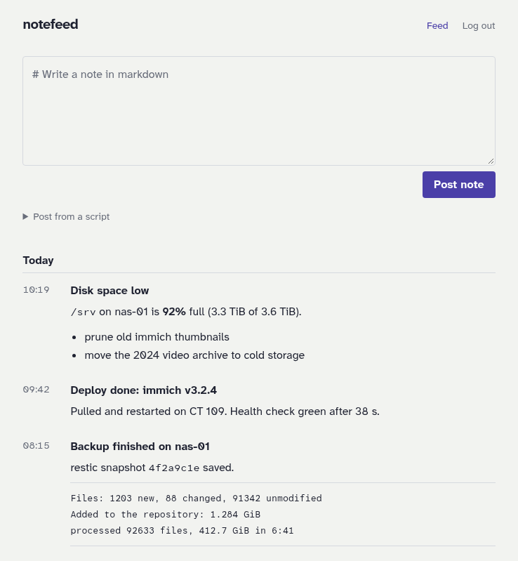

# notefeed

[](https://notefeed.me)
[](https://docs.notefeed.me)
[](https://github.com/notefeed/notefeed/pkgs/container/notefeed)
[](https://www.npmjs.com/package/notefeed)
[](https://pypi.org/project/notefeed/)
[](https://m8ven.ai/mcp/notefeed-notefeed-1y7zvn?s=readme)

Post short markdown notes to a named feed — from a script over HTTP, or by hand in a small web UI — and read them back as RSS. Like [ntfy](https://ntfy.sh), but for notes: there are no accounts, a feed is just a name, and each note is a plain `.md` file on disk. Built as an inbox for dashboards like Glance and Dynacat, which can read RSS but have nowhere to post to.

- **Self-host: [Check releases](https://github.com/notefeed/notefeed/releases)** or **[GHCR](https://github.com/notefeed/notefeed/pkgs/container/notefeed)**   
- **Hosted version: https://notefeed.me**  
- **Documentation: https://docs.notefeed.me/**

notefeed is private by default and stores nothing about a person; [sign-in with a verified sender](https://docs.notefeed.me/self-hosting/sign-in/) is opt-in.

<picture>
  <source media="(prefers-color-scheme: dark)" srcset="docs/assets/screenshot-dark.png">
  
</picture>

## Quick start

Save this as `compose.yaml`, create the data folder, and start it:

```yaml
services:
  notefeed:
    image: ghcr.io/notefeed/notefeed:latest
    restart: unless-stopped
    ports:
      - "3000:3000"
    volumes:
      - ./data:/data
```

```sh
mkdir data   # notes are written as the owner of this folder
docker compose up -d
```

Open http://localhost:3000 and pick a feed name. Anyone who knows the name can read and post to that feed, so make it hard to guess. Post from a script:

```sh
curl -H "Content-Type: text/markdown" --data-binary @note.md http://localhost:3000/homelab-7f3k2q9x4m8wz
```

Or with a client: `pip install notefeed` / `npm install notefeed`, then `notefeed post "# Hello" --feed homelab-7f3k2q9x4m8wz`.

The answer includes the feed's `read_url`: a read-only RSS link to give to feed readers and dashboards. It doesn't reveal the feed name (except for operator-only [reserved feeds](docs/self-hosting/reserved-feeds.md), whose read link is their name), and it can't post. A feed created since feed deletion was added has a random read id of its own, so deleting a feed and creating its name again gives a new link.

To require a password for posting and the web UI, set `NOTEFEED_PASSWORD`. Read links stay open. See [Configuration](https://docs.notefeed.me/self-hosting/configuration/). To protect a single feed, create it with `curl -H "X-Feed-Password: ..."`; see [Posting notes](https://docs.notefeed.me/using/feed-passwords/#in-the-api).

A feed can get a title, a description and a title image and can be deleted with everything in it, from the web UI, the API and the client packages; see [Feed settings and deleting a feed](https://docs.notefeed.me/using/feeds/#feed-settings-in-the-api). Posted notes can be edited and deleted from the web UI, the API, the clients and MCP; see [Editing and deleting notes](https://docs.notefeed.me/using/editing/). AI assistants can post, read, edit and delete notes over MCP at `/mcp`; see [MCP](https://docs.notefeed.me/integrations/mcp/).

Pictures are notes too: drop or paste them into the web UI's compose box (they are posted with the note), or post one with `Content-Type: image/png` (or `notefeed post --file photo.png`), and write `` in a markdown note to show it; see [Pictures](https://docs.notefeed.me/using/pictures/). Pictures are public to anyone with the feed's read link, and are stored as posted, with metadata such as GPS position left in.

## Development

```sh
npm ci
npm run dev        # http://localhost:3000
npm test           # unit tests; npm run test:e2e for the browser tests
npm run generate   # after changing the API in backend/http/api.ts
```

The REST API is defined in code (`backend/http/api.ts`). `npm run generate` writes `openapi.json` from it, and from that the JS clients (`packages/js/src/generated/`, `app/_lib/api/`) and the Python client (`packages/python/src/notefeed/_generated/`). All of it is committed; CI fails when anything is stale. Generating needs Node 22.18 or newer (`.nvmrc`) and [uv](https://docs.astral.sh/uv/). The client packages: `cd packages/js && npm test`, `cd packages/python && uv run --extra test pytest`.

## License

- **The notefeed server** (the web app and the Docker image) is licensed under the [GNU Affero General Public License v3.0](LICENSE). You can self-host it for free, for yourself or your company. If you run a modified version as a service for others, you must publish your changes under the same license.
- **The client packages** (`packages/python`, `packages/js`) are licensed under the [Apache License 2.0](packages/js/LICENSE), so any app or script can use them.

Versions up to and including 0.2.x were released under the MIT License.
